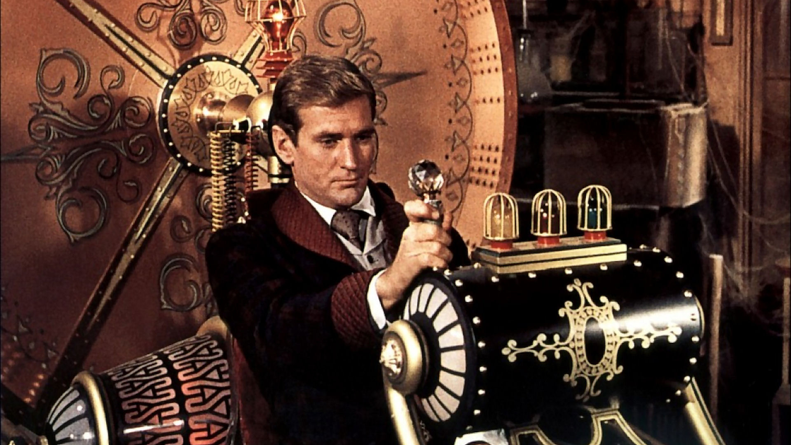

  

# The Time Machine

This repository contains the source code for the world's first time machine developed by an individual. The risk is
yours to bear, and it is licensed under the [MIT License.](./LICENSE)

# Usage

One represents 1 second. If you want to go back 1 minute, enter -60.

| 1 second | 1 minute | 1 hour | 1 day  | 1 month  | 1 year    | 10 years   |
|----------|----------|--------|--------|----------|-----------|------------|
| -1       | -60      | -3600  | -86400 | -2592000 | -31536000 | -315360000 |

# Precautions

- **Note that your horizon coordinate system is not fixed:** When you turn back time, you may wander in space, so wear a
  spacesuit and bring enough oxygen tanks to travel through time. Additionally, sufficient meditation and mental
  preparation can be helpful.
- **Use the restroom beforehand:** You may suddenly want to go to the bathroom. There may be a time period without
  modern toilets, so go beforehand without any inconvenience. (Wash your hands)
- **Do not try to meet famous people:** You can change history. A handshake might be okay. (If you have washed your
  hands)
- **Do not take too much financial gain:** The profit of a pizza is okay (if you don't get caught), but if you take too
  much financial gain, other time travelers may try to steal your golden statue.
- **Do not visit the restaurant:** Just... don't. It's disturbing.
- **Hounds of Tindalos' meat is not as tasty as you think:** It's an anecdote, but it might be more delicious to burn it
  and eat it as ash.
- **Infinite Dragonflight is kinder than you think:** He shared meat presumed to be lamb, but it had a slightly
  bitter taste. Still, it's quite delicious, so if possible, try it out. If possible.

# Contribute

This source code and various precautions and usage instructions are maintained and managed by the open-source community.
I wish you healthy time travel.
